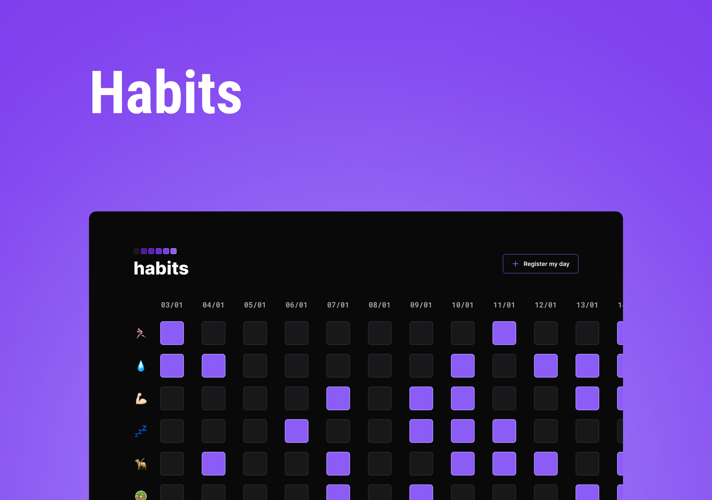

<h1 align="center"> Habits </h1>

This project was developed during the NLW week, a project promoted by the Rocketseat web technology teaching platform.  

  <a href="#-technologies">Technologies</a>&nbsp;&nbsp;&nbsp;|&nbsp;&nbsp;&nbsp;
  <a href="#-project">Project</a>&nbsp;&nbsp;&nbsp;
  |&nbsp;&nbsp;&nbsp;
  <a href="#memo-license">License</a>

  

 

## 🚀 Technologies

This project was developed with the following technologies:

- HTML and CSS
- JavaScript
- Git and Github
- Figma

## 💻 Project

Habits is an app to help track habits and you can only add one day at a time[for now :)].

- [Visit the project online](https://nabreu22.github.io/habit-list)

## :memo: License

This project is licensed under the MIT license.

---
